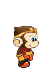
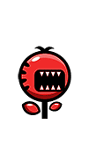

# Classic Arcade Game Clone With Animation and Sound

This is an arcade-style game utilizing Object Oriented JavaScript. The goal of the game is to get the hero across the field inhabited by crazy Evil Chomper Plants that are running amok. If our hero is bitten by an Evil Chomper Plant, the round is reset and you must try again. If our hero reaches the water, the score increases, and you get to go again.

-Go Api
---
  
-Evil Chomper Plant
---

To play:
---
- Left and Right arrow keys will make our hero run to the left or right.
- Up arrow key makes our hero jump toward the river.
- Down arrow key makes our hero jump back toward the sidewalk where the Evil Chomper Plants can't go.
- Hitting the space key will toggle the game on and off.
- If our hero is bit, she/he falls back to the starting position.
- Our hero will get right back up with a nudge.
- If our hero wins, we'll spend a few seconds dancing, and it's right back to the starting position.
- Be patient of the well-deserved celebrating; you won't be able to move until it is over.
- As the game proceeds, the Evil Chomper Plants may get angrier and speed up.
- And, most important: super heros never die, so, go for really big scores!!
- You can use a mouse or touch instead of the keys, but our hero only will move to an adjacent position. To play make sure you point only left, right, up, or down. No diagonals or big jumps, please.

Browser Compatibility
---
This game has been tested and appears to work well on these browsers on a Mac OSX Yosemite:
* Google Chrome Version 45.0.2454.85
* Firefox Version 40.0.3
* Opera Version 31.0
* Safari Version Version 8.0.8

Device Compatibility
---
In an effort to add device compatibility, this game was designed to be 1) responsive to screen size, 2) work with a mouse, and 3) be touch sensitive.
- It has been tested on a Samsung Galaxy Tab 4 tablet and plays well. Using Google Chrome on the tablet allows you to save the game to your home page.
- Unfortunately, it has also been tested on a Samsung Galaxy S6 and does not respond well enough to touch to be enjoyable.
- iPhone and iPad emulation under Google Chrome Developer Tools, suggests that the game may play on these devices.

Limitations
---
- An attempt was made to create a mobile device app with [PhoneGap Build](https://build.phonegap.com/apps) but the resulting app is not touch responsive enough to be enjoybale.
- It is likely that the configuration for the Hammer.js plugin (mouse and touch capabilities) needs to be tuned for better touch performance on small devices.

Demo
---
- You can see the demo at [I Got A Camera - Arcade Game ](http://igotacamera.com/arcade/).

## Installation
- Clone the repository from [GitHub](http://GitHub.com/cynthiateeters/arcade-game) and unzip it into a directory accessible to your browser.
- Open the index.html file in your browser and it should immediately allow you to play.

## Possible Later Enhancements
- Add different styled enemies.
- Add a splash screen.
- Add support messages to the user when playing.
- Give user the ability to choose a hero.
- Add a truck that drives across on the road spilling fish.
- Add fish dumped by the truck that then need to be saved and put in the water.

## License and Resources
"Arcade Game" by Cynthia Teeters © 2015 can be used under [CC BY-SA 4.0](http://creativecommons.org/licenses/by-sa/4.0/).
- Images used to make the characters Evil Chompers were originally made by [Bevouliin - Imaginary Perception](http://bevouliin.com), and obtained from [OpenGameArt](http://opengameart.org) under a [CC0 public domain license](http://creativecommons.org/publicdomain/zero/1.0/).
- Images to make litlle monkey were originally made by [fikri](http://graphicriver.net/user/fikri) and purchased under [Envato Standard License](http://graphicriver.net/licenses/standard?license=regular).
- pacmanwakka.wav (created by remaxim) was obtained from [OpenGameArt](http://opengameart.org/content/pacman-clone-wakka-sound) under a [CC-BY-SA 3.0 license](http://creativecommons.org/licenses/by-sa/3.0/).
- round_end.wac (created by sauer2) was obtained from [OpenGameArt](http://opengameart.org/content/oldschool-win-and-die-jump-and-run-soundscreated) under [CC0 license](http://creativecommons.org/publicdomain/zero/1.0/).
